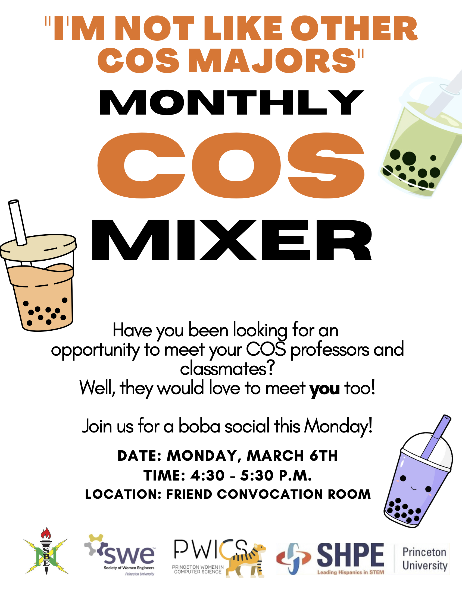

##  ATTENTION COS DEPARTMENT !!

REGISTER HERE: <https://forms.gle/fYjsSWy1xVWGNdGu9>

For **THIS MONDAY'S MARCH 6TH** COS mixer and boba social!

EVERYONE IS WELCOME!

COME MEET FELLOW COS PROFESSORS, STAFF, POSTDOCS, GRAD

AND UNDERGRAD STUDENTS IN

**[THE FRIEND CONVOCATION ROOM](https://m.princeton.edu/default/map/index?filter=Friend&_recenter=true&feed=campus_map&id=_T013&parentId=campus_map%2FTransit)@ 4 30 PM **

There will be a group activity called "_I'm not like other COS majors_" focussed on interdisciplinary interests in computer science, opening up room for engaging social interactions.

**SEE YOU THERE!**

